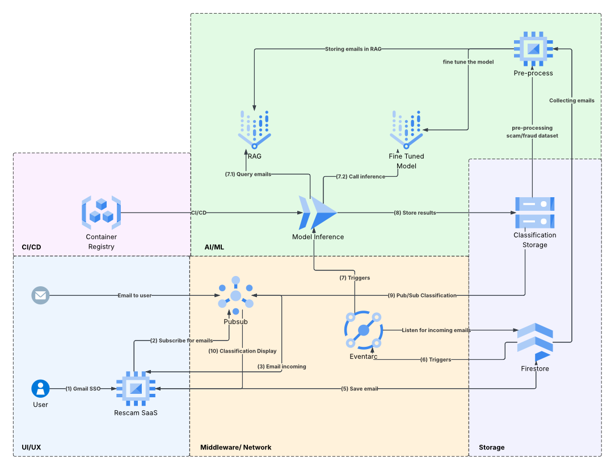

# Rescam - Phishing Email Detection with RAG

Rescam is a phishing email detection system that uses Retrieval-Augmented Generation (RAG) to classify emails as benign, spam, scam, or suspicious. The system combines Vertex AI Vector Search for semantic similarity matching with Google's Gemini model for intelligent classification based on retrieved context.

<video autoplay loop muted controls src="RescamDemoMS4.mov" width="1280" height="720"></video>

## 📋 Table of Contents

- [🏗️ Architecture Overview](#architecture-overview)
- [🔄 DataPipeline - Preprocess Container](#data-pipeline)
- [🤖 Fraud Classification Service - Cloud Run](#rag-model-design)
- [🧠 Model Fine-Tuning](#model-fine-tuning)
- [🚀 SaaS Application - Docker Compose Containers](#docker-compose-containers)
- [📜 Appendix](#appendix)

## 🏗️ Architecture Overview

The Rescam system consists of three main components:

1. **Data Pipeline** (`src/datapipeline/`): Processes raw email datasets, creates unified datasets, and builds a RAG index using Vertex AI Vector Search
2. **Models** (`src/models/`): Uses the RAG index to classify new emails using a Gemini-based classifier
3. **Web App** (`src/app/`): A React-based web application that provides a user interface for interacting with the Rescam system

### Here is an overview of the system:



## 🔄 DataPipeline - Preprocess Container

The data pipeline consists of two main preprocessing scripts:

### 1. `preprocess_clean.py`

**Purpose**: Accesses the GCP bucket, downloads raw email datasets, and creates a unified, cleaned dataset.

**What it does**:
- Downloads raw email CSV files from GCP bucket using `dataloader.py`
- Parses and cleans email data (sender, receiver, date, subject, body, labels, URLs)
- Filters and validates email records (ensures labels are 0 or 1)
- Combines all raw datasets into a single unified dataset
- Saves cleaned data as Parquet format (compressed, efficient for tabular data)
- Uploads the cleaned dataset back to GCS bucket

**Key Features**:
- Handles large CSV files with extended field size limits
- Preserves email metadata (sender, subject, date, URLs, spam flags)
- Tracks source database for each email
- Uses Parquet format for efficient storage and querying

### 2. `preprocess_rag.py`

**Purpose**: Creates the Vertex AI RAG (Retrieval-Augmented Generation) index by generating embeddings for all emails and indexing them in Vertex AI Vector Search.

**What it does**:
- Downloads cleaned email dataset from GCS bucket
- Generates embeddings for email content using `sentence-transformers` (all-MiniLM-L6-v2 model, 384 dimensions)
- Formats embeddings in Vertex AI-compatible JSONL format
- Uploads embeddings to GCS bucket for Vertex AI Vector Search
- Provides instructions for creating and deploying the Vertex AI index

**Technical Details**:
- **Embedding Model**: `all-MiniLM-L6-v2` (384-dimensional vectors)
- **Storage Format**: JSONL (one embedding per line with ID, embedding vector, and optional metadata)
- **Bucket Location**: `gs://rescam-dataset-bucket/vertex_ai_embeddings/`
- **Index Configuration**: Tree-AH algorithm for approximate nearest neighbor search

**Helper Files**:
- `query_vertex_ai.py`: Tests RAG retrieval by querying the Vertex AI index
- `upload_fake_data.py`: Utility for uploading test data to GCS
- `generate_fake_emails.py`: Generates synthetic email data for testing
- `dataloader.py`: Helper module for GCS bucket operations and file management

## 🤖 Fraud Classification Service - Cloud Run

This is our Cloud Run componenet that handles the classification of emails using RAG-enabled generative AI.
This happens via first listening to firestore for new emails, then using the RAG model to classify them and finally updating the GCS Bucket with the classification result.

### 1. `model_rag.py`

**Purpose**: Classifies emails using RAG-enabled generative AI.

**How it works**:

1. **Email Retrieval**: 
   - Reads email content from GCS bucket
   - Generates embedding for the email using the same sentence transformer model
   - Queries Vertex AI Vector Search to find similar emails (k=5 nearest neighbors)
   - Retrieves email metadata (sender, subject, labels) from local parquet file

2. **Context Building**:
   - Constructs RAG context string from retrieved similar emails
   - Includes distance scores, sender information, subjects, and labels
   - Formats context for inclusion in the classification prompt

3. **Classification**:
   - Uses Google's Gemini 2.5 Flash Lite model for classification
   - Provides comprehensive instruction prompt with:
     - Classification categories (benign, spam, scam, suspicious)
     - Heuristics for detection (sender identity, lookalike domains, urgent language, etc.)
     - Expected output format (JSON with classification, confidence, reasons, indicators)
   - Returns structured JSON classification result

**Output Format**:
```json
{
  "classification": "benign | spam | scam | suspicious",
  "confidence": 0.0-1.0,
  "primary_reason": "Evidence summary",
  "indicators": ["list", "of", "detected", "indicators"],
  "evidence": [
    {"source": "current_email", "quote": "..."},
    {"source": "rag", "quote": "..."}
  ],
  "parsed": {
    "sender_display": "...",
    "sender_email": "...",
    "from_domain": "...",
    "reply_to": "...",
    "links": ["..."],
    "attachments": ["..."]
  },
  "recommended_action": "allow | quarantine | warn_user | block_sender | report_phishing"
}
```

**Default Arguments**:
- Project ID: `1097076476714`
- Location: `us-east1`
- Index Endpoint ID: `3044332193032699904`
- Deployed Index ID: `phishing_emails_deployed_1760372787396`
- GCS Bucket: `rescam-dataset-bucket`
- Default email file: `example_last_email.txt`

### 2. `firestore_event_handler.py`

This is our Cloud Function that handles the classification of emails using RAG-enabled generative AI.
This happens via first listening to firestore for new emails, then using the RAG model to classify them and finally updating the GCS Bucket with the classification result.

### 3. Deployment as Cloud Run

Separate deployment for the classificatino model as Cloud Run to be able to run everytime an incoming email is added to firestore.

```bash
# 1. Authenticate Docker with GCR
gcloud auth configure-docker


# 2. Build with Tag and Push
docker buildx build --platform linux/amd64 \
  -t gcr.io/articulate-fort-472520-p2/firestore-event-handler:latest \
  -f src/models/Dockerfile \
  --push .

# 3. Deploy on google Cloud Run
gcloud run deploy firestore-event-handler \
  --image gcr.io/articulate-fort-472520-p2/firestore-event-handler:latest \
  --platform managed \
  --region us-central1 \
  --project articulate-fort-472520-p2 \
  --allow-unauthenticated \
  --set-env-vars GCP_PROJECT_ID=articulate-fort-472520-p2
```

## 🧠 Model Fine-Tuning

The `src/finetuning/` directory contains the pipeline for fine-tuning the Gemini 1.5 Flash model on our labeled phishing email dataset. This process specializes the model to better distinguish between benign, spam, scam, and suspicious emails based on our specific data patterns.

### Key Components

1.  **Training Script** (`src/finetuning/train_model.py`):
    - Handles the end-to-end fine-tuning process
    - Downloads and validates data from GCS
    - Converts data to Gemini-compatible JSONL format
    - Launches the Vertex AI fine-tuning job
    - Logs all experiment metadata for reproducibility

2.  **Configuration** (`src/finetuning/training_config.json`):
    - Defines dataset sources and label mappings
    - Sets training parameters (epochs, learning rate, etc.)
    - Configures Vertex AI settings (region, project, bucket)

### Workflow

1.  **Data Preparation**: The script downloads the `cleaned_dataset.parquet` from GCS, validates it, and balances the dataset (approx. 50/50 split between phishing and legitimate emails).
2.  **Transformation**: Data is converted into the specific JSONL format required by Gemini fine-tuning, with structured prompts.
3.  **Training**: A fine-tuning job is submitted to Vertex AI. The job runs asynchronously on Google Cloud infrastructure.
4.  **Logging**: Detailed experiment logs (including dataset version, hyperparameters, and job IDs) are saved locally and uploaded to GCS for full traceability.

### Usage

To run the fine-tuning process using Docker:

1.  **Build the container**:
    ```bash
    docker build -t rescam-finetuning -f src/finetuning/Dockerfile .
    ```

2.  **Run the training job**:
    ```bash
    # Dry-run (validate data and config)
    docker run --rm \
      -v $(pwd)/secrets:/home/app/.config/gcloud:ro \
      -e GOOGLE_APPLICATION_CREDENTIALS=/home/app/.config/gcloud/application_default_credentials.json \
      rescam-finetuning python train_model.py --dry-run --max-examples 100

    # Start full fine-tuning job
    docker run --rm \
      -v $(pwd)/secrets:/home/app/.config/gcloud:ro \
      -e GOOGLE_APPLICATION_CREDENTIALS=/home/app/.config/gcloud/application_default_credentials.json \
      rescam-finetuning python train_model.py --max-examples 1000
    ```

    *Note: Ensure you have your GCP credentials in `secrets/application_default_credentials.json`.*

For a detailed summary of the fine-tuning milestone, see [`src/finetuning/MILESTONE4_FINETUNING_SUMMARY.md`](src/finetuning/MILESTONE4_FINETUNING_SUMMARY.md).

## 🚀 SaaS Application - Docker Compose Containers

This is our SaaS application that provides a user interface for interacting with the Rescam system.

### 1. `src/app`

This is our React application that provides a user interface for interacting with the Rescam system.

### 2. `src/api`

This is our FastAPI/Node application that provides a REST API for interacting with the Rescam system.

### 3. Local Development Deployment

For local development, run:
```bash
docker-compose up
```

On a different terminal run (to setup the ngrok tunnel so we would get the pubsub push):
```bash
ngrok http 5050
```

Copy the URL ngrok provided and run this in terminal (with example url):
```bash
gcloud pubsub subscriptions create gmail-notifications-push \
     --topic=gmail-notifications \
     --push-endpoint=https://prewireless-malaceous-earlie.ngrok-free.dev \
     --project=articulate-fort-472520-p2
```

Production
```
gcloud pubsub subscriptions create gmail-notifications-push \
     --topic=gmail-notifications \
     --push-endpoint=https://35-224-238-97.nip.io/ \
     --project=articulate-fort-472520-p2
```

Then navigate to http://localhost:3000/
- sign in with google (amitberger02@gmail.com)
- start watch (pub/sub)
- send email to yourself
- View it in dashboard

### 4. Production Deployment (GCP Compute Engine with HTTPS)

For production deployment on Google Cloud Platform with HTTPS support:

**🌐 Live Production URL**: https://35-224-238-97.nip.io

**Prerequisites:**
- GCP Compute Engine VM with static external IP
- Firewall rules allowing ports 80, 443, and 22
- Docker and Docker Compose installed on VM

**Quick Start:**
1. Clone repository to VM: `git clone <repo-url> ~/rescam && cd ~/rescam`
2. Copy GCP credentials to VM: `scp -r ./secrets/ user@<vm-ip>:~/rescam/secrets/`
3. Obtain SSL certificate: `sudo certbot certonly --standalone -d 35-224-238-97.nip.io`
4. Build and start containers: `docker-compose build --no-cache && docker-compose up -d`
5. Configure Nginx: `sudo cp nginx-host.conf /etc/nginx/sites-available/rescam && sudo systemctl start nginx`
6. Update OAuth origins in [Google Cloud Console](https://console.cloud.google.com/apis/credentials)
7. Update Pub/Sub webhook URL to `https://35-224-238-97.nip.io/api/pubsub/webhook`

**📖 Complete Deployment Guide**: See [reports/GCP_HTTPS_DEPLOYMENT.md](reports/GCP_HTTPS_DEPLOYMENT.md) for detailed step-by-step instructions, troubleshooting, and maintenance procedures.

**Key Features:**
- ✅ Free DNS via nip.io (no domain purchase required)
- ✅ Valid SSL certificates from Let's Encrypt (auto-renewing)
- ✅ HTTP → HTTPS automatic redirect
- ✅ Security headers (HSTS, X-Frame-Options, etc.)
- ✅ Server-Sent Events (SSE) support for real-time email updates
- ✅ Production-ready Nginx reverse proxy configuration


## 📜 Appendix

### 🔧 Environment Setup

#### Prerequisites

- Python 3.12+
- Google Cloud Platform account with billing enabled
- GCP Project ID: `1097076476714`
- Docker and Docker Compose installed
- Google Cloud SDK (`gcloud`) installed and authenticated

#### GCP Authentication

1. **Install Google Cloud SDK** (if not already installed):
   ```bash
   # macOS
   brew install google-cloud-sdk
   ```

2. **Authenticate with GCP**:
   ```bash
   gcloud init
   gcloud auth application-default login
   gcloud config set project 1097076476714
   gcloud auth application-default set-quota-project 1097076476714
   ```

   This creates authentication files in:
   - `~/.config/gcloud/application_default_credentials.json`
   - `~/.config/gcloud/config.yaml`

3. **Copy credentials to project** (for Docker containers):
   ```bash
   mkdir -p src/datapipeline/secrets src/models/secrets
   cp ~/.config/gcloud/application_default_credentials.json src/datapipeline/secrets/
   cp ~/.config/gcloud/application_default_credentials.json src/models/secrets/
   ```

To run everyting make sure you got:
```bash
secrets/application_default_credentials.json
secrets/client_secret_1097076476714-9iaegt01febhsqh14niv8m2sjl8q07n7.apps.googleusercontent.com.json

# Same .env -> see SETUP_GUIDE
.env
src/app/.env
src/api/.env
```

#### Enable Required APIs

Enable the following Google Cloud APIs:

```bash
gcloud services enable aiplatform.googleapis.com --project=1097076476714
gcloud services enable storage-api.googleapis.com --project=1097076476714
```

### Detailed Workflow

#### Step 1: Clean and Prepare Data

```bash
# Using docker-compose
docker-compose up datapipeline

# Or manually
cd src/datapipeline
docker build -t preprocess-data -f Dockerfile .
docker run --rm -it \
  -v $(pwd)/secrets:/home/app/.config/gcloud:ro \
  preprocess-data bash

# Inside container
source /home/app/.venv/bin/activate
python preprocess_clean.py
```

**What happens**:
- Downloads raw email CSV files from GCS bucket
- Creates unified `cleaned_dataset.parquet`
- Uploads cleaned dataset back to GCS

#### Step 2: Create RAG Index

```bash
# Using docker-compose (runs after preprocess_clean.py)
docker-compose up datapipeline

# Or manually inside the container
python preprocess_rag.py
```

**What happens**:
- Downloads cleaned dataset from GCS
- Generates embeddings for all emails
- Uploads embeddings to `gs://rescam-dataset-bucket/vertex_ai_embeddings/`

**Next Steps** (Manual in GCP Console):
1. Create Vertex AI Vector Search Index (see `src/datapipeline/VERTEX_AI_SETUP.md`)
2. Create Index Endpoint
3. Deploy index to endpoint
4. Note the endpoint ID and deployed index ID

#### Step 3: Test RAG Retrieval (Optional)

```bash
cd src/datapipeline
docker-compose run --rm datapipeline bash -c "source /home/app/.venv/bin/activate && python query_vertex_ai.py"
```

### View Logs

```bash
# All services
docker-compose logs -f

# Specific service
docker-compose logs -f datapipeline
docker-compose logs -f models
```

### Stop Containers

```bash
# Stop and remove containers
docker-compose down

# Stop but keep containers
docker-compose stop
```

### 🔒 Security Notes

**Current Setup (Development)**:
- Credentials are copied to `secrets/` directory and mounted into containers
- Credentials are git-ignored for security

**Production Recommendations** (from Journal.md):
1. **Service Account Keys**: Create a dedicated service account with minimal permissions
2. **Environment Variables**: Use environment variables instead of file mounting
3. **Workload Identity**: Use Google Cloud Run or Kubernetes with Workload Identity (most secure)

### 🆘 Troubleshooting

### Common Issues

**"Permission denied" when accessing GCS**:
- Verify credentials are in `secrets/` directory
- Check that `GOOGLE_APPLICATION_CREDENTIALS` is set correctly
- Ensure GCS bucket permissions are configured

**"Index endpoint not found"**:
- Verify Vertex AI index is deployed to endpoint
- Check endpoint ID and deployed index ID match your configuration
- Wait for deployment to complete (can take 20+ minutes)

**"No similar emails found" in RAG retrieval**:
- Verify `email_metadata.parquet` exists in working directory
- Check that embeddings were uploaded correctly
- Ensure index is ready and deployed

**Container won't start**:
- Check Docker logs: `docker-compose logs`
- Verify credentials file exists in `secrets/` directory
- Rebuild containers: `docker-compose build --no-cache`

### Working on email pipeline

#### Setup the sso + pub/sub for incoming emails
```bash
# Run both the api and the frontend containers
docker-compose up --build
```
Then open the local browser on:
```bash
localhost:3000
```

Log in with amitberger02@gmail.com (test user)
Then click the "Watch" button.
Finally -> send an email to amitberger02@gmail.com


#### Setup the infer docker:

Goal of this docker: listen for Firestore changes -> get the Eventarc response and get the actual email stored -> call gemini with RAG and infer what is the classidication of this, then store back to GCS at rescam-user-emails/user-classifications/amitberger02@gmail.com/emails.json

This oneliner build+run:
```bash
docker build -t firestore-event-handler -f src/models/Dockerfile . && docker run --rm -p 8080:8080 -v $(pwd)/secrets:/home/app/.config/gcloud:ro -e GOOGLE_APPLICATION_CREDENTIALS=/home/app/.config/gcloud/application_default_credentials.json -e GCP_PROJECT_ID=articulate-fort-472520-p2 -e PORT=8080 -e GEMINI_API_KEY=$GEMINI_API_KEY firestore-event-handler 
```

Or this
```bash
# Build the container
docker build -t firestore-event-handler -f src/models/Dockerfile . 

# Run the container
docker run -d \                                                   
  --name firestore-handler-test \
  -p 8080:8080 \
  -v $(pwd)/secrets:/home/app/.config/gcloud:ro \
  -e GOOGLE_APPLICATION_CREDENTIALS=/home/app/.config/gcloud/application_default_credentials.json \
  -e GCP_PROJECT_ID=articulate-fort-472520-p2 \
  -e PORT=8080 \
  firestore-event-handler

# Track the logs
docker logs -f firestore-handler-test
```


To test this:
```bash
./src/tests/models/test_firestore_event.sh
```

### Pushing the docker to dockerhub to run from a contrainer

```bash
# 1. Authenticate Docker with GCR
gcloud auth configure-docker


# 2. Build with Tag and Push
docker buildx build --platform linux/amd64 \
  -t gcr.io/articulate-fort-472520-p2/firestore-event-handler:latest \
  -f src/models/Dockerfile \
  --push .

# 3. Deploy on google Cloud Run
gcloud run deploy firestore-event-handler \
  --image gcr.io/articulate-fort-472520-p2/firestore-event-handler:latest \
  --platform managed \
  --region us-central1 \
  --project articulate-fort-472520-p2 \
  --allow-unauthenticated \
  --set-env-vars GCP_PROJECT_ID=articulate-fort-472520-p2
```

#### Fixing multi platform (only linux support) issue

Problem:
```bash
amitberger@Amits-MacBook-Pro AC215_rescam % docker manifest inspect gcr.io/articulate-fort-472520-p2/firestore-event-handler:latest

{
   "schemaVersion": 2,
   "mediaType": "application/vnd.oci.image.index.v1+json",
   "manifests": [
      {
         "mediaType": "application/vnd.oci.image.manifest.v1+json",
         "size": 2948,
         "digest": "sha256:981c0624dab8a6ab87ead7ee02336cf657bc4fdb4c956eb2711b6fcce1861dcc",
         "platform": {
            "architecture": "arm64",
            "os": "linux"
         }
      },
      {
         "mediaType": "application/vnd.oci.image.manifest.v1+json",
         "size": 566,
         "digest": "sha256:567bf591392d2fa7555eab2e5e32c1272d49459a428c934fdc4e253c9706ce3e",
         "platform": {
            "architecture": "unknown",
            "os": "unknown"
         }
      }
   ]
}
```
We need to remove the second one and leave the arm linux entry intact.

```bash
# Create a new manifest with only the arm64 entry (this will overwrite the existing one)
docker manifest create gcr.io/articulate-fort-472520-p2/firestore-event-handler:latest \
  gcr.io/articulate-fort-472520-p2/firestore-event-handler@sha256:981c0624dab8a6ab87ead7ee02336cf657bc4fdb4c956eb2711b6fcce1861dcc --amend

# Annotate with the correct platform
docker manifest annotate \
  --os linux \
  --arch amd64 \
  gcr.io/articulate-fort-472520-p2/firestore-event-handler:latest \
  gcr.io/articulate-fort-472520-p2/firestore-event-handler@sha256:981c0624dab8a6ab87ead7ee02336cf657bc4fdb4c956eb2711b6fcce1861dcc

# Push the updated manifest (this overwrites the remote manifest)
docker manifest push gcr.io/articulate-fort-472520-p2/firestore-event-handler:latest

# Finally check again:
amitberger@Amits-MacBook-Pro AC215_rescam % docker manifest inspect gcr.io/articulate-fort-472520-p2/firestore-event-handler:latest
{
   "schemaVersion": 2,
   "mediaType": "application/vnd.oci.image.index.v1+json",
   "manifests": [
      {
         "mediaType": "application/vnd.oci.image.manifest.v1+json",
         "size": 2948,
         "digest": "sha256:981c0624dab8a6ab87ead7ee02336cf657bc4fdb4c956eb2711b6fcce1861dcc",
         "platform": {
            "architecture": "arm64",
            "os": "linux",
            "variant": "v8"
         }
      }
   ]
}
```

Now we can run the Cloud Run deploment again

```bash
# 4. Deploy on google run a new revision
gcloud run deploy firestore-event-handler \
  --image gcr.io/articulate-fort-472520-p2/firestore-event-handler:latest \
  --platform managed \
  --region us-central1 \
  --project articulate-fort-472520-p2 \
  --allow-unauthenticated \
  --set-env-vars GCP_PROJECT_ID=articulate-fort-472520-p2
```

#### Explicit tage and pushes

```bash
# 2. Tag your image for GCR (replace REGION with us-central1, us-east1, etc.)
docker tag firestore-event-handler gcr.io/articulate-fort-472520-p2/firestore-event-handler:latest

# 3. Push to GCR
docker push gcr.io/articulate-fort-472520-p2/firestore-event-handler:latest
```

### Protobuf support

Messages from Firestore are in Protobuf format. No built in python support so had to do some magic
I cloned the proto file from google's github and ran:
```bash
# Must be protobuf@29 to avoid problems with dependencies
brew install protobuf@29

# Run this to create the python protobuf object
protoc --python_out=. ./protobuf_schema/firestore_message.proto
```
to create src/models/protobuf_schema/firestore_message_pb2.py
Then used it in the code to parse the event and it worked out!